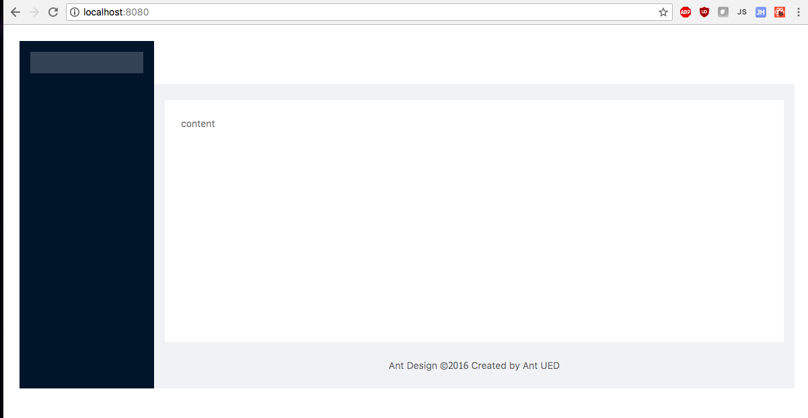
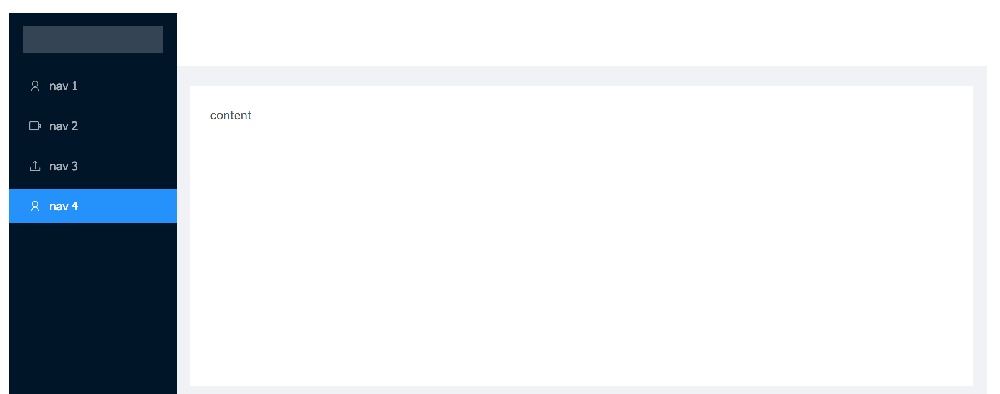
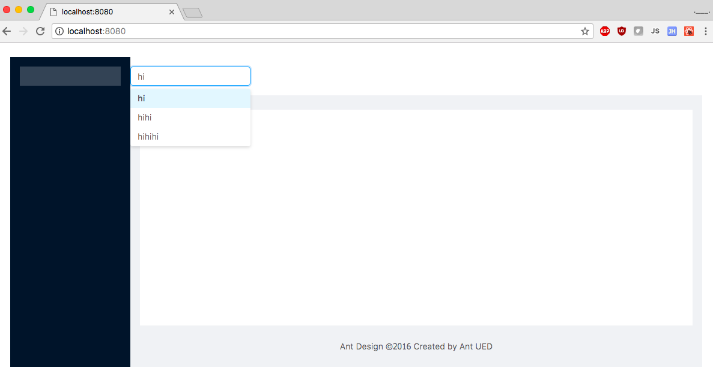

# CS52 Workshops:  React Components


Just like bootstrap or semantic-ui, but for React! Prebuilt components & styling. No re-inventing the wheel.

## Overview

Ant Design (https://ant.design/docs/react/introduce) is a React UI library with components you can use in your React app.
We will be using Ant Design to make a landing page.

We will implement:
* a Ant Design's basic layout
    * Header
    * Sider (responsive navigation)
    * Content
    * Footer
* Search bar with autocomplete

## Setup

Pull from our directory. This contains a starterpack and some starting code.
```
$ git remote add starter https://github.com/Flashing3/workshopstarter
$ git pull starter master --allow-unrelated-histories
```

Install antd from yarn.
```
$ yarn add antd
```

## Overview of Layout Components
Here are the basic components we are using today!

```Layout``` : The layout wrapper, in which Header Sider Content Footer or Layout itself can be nested, and can be placed in any parent container.

```Header```: The top layout with default style, in which any element can be nested, and must be placed in Layout.

```Sider``` : The sidebar with default style and basic functions, in which any element can be nested, and must be placed in Layout.

```Content``` : The content layout with default style, in which any element can be nested, and must be placed in Layout.

```Footer``` : The bottom layout with default style, in which any element can be nested, and must be placed in Layout.
Layout handles the overall layout of a page.

(More info: https://ant.design/components/layout/).


## 1. Add Layout

Import Layout, Menu and Icon at the top of your index.js file.
```javascript
import { Layout, Menu, Icon } from 'antd';
```

Next, let's add Ant Design's css!  Add antd/dist/antd.css manually into your index.js. Your imports should look like this:

```javascript
import React from 'react';
import ReactDOM from 'react-dom';
import { Layout, Menu, Icon } from 'antd';
import 'antd/dist/antd.css';
import './style.scss';
```

#### Sidenote on importing css:
(Normally if you were using your starterpack, you can do the following. This allows you to import components without having to manually import the corresponding stylesheet. It imports it for you.)
```
{
  "plugins": [
    ["import", { "libraryName": "antd", "libraryDirectory": "es", "style": "css" }] // `style: true` for less
  ]
}
```


Now do run it!
```bash
$ yarn start
```

Now you should see this. There's a Sider but no menu items.


Look at your index.js. In between the <Menu> </Menu> tags, add the following code to create menu items.

```html
<Menu.Item key="1">
  <Icon type="user" />
  <span className="nav-text">nav 1</span>
</Menu.Item>
<Menu.Item key="2">
  <Icon type="video-camera" />
  <span className="nav-text">nav 2</span>
</Menu.Item>
<Menu.Item key="3">
  <Icon type="upload" />
  <span className="nav-text">nav 3</span>
</Menu.Item>
<Menu.Item key="4">
  <Icon type="user" />
  <span className="nav-text">nav 4</span>
</Menu.Item>
```

You should see some menu items in the Sider.


## 2. Add an autocomplete search bar :mag:

Our search bar will live in a new component! You need to add this in. :smiling_imp:
Make a new `components` directory in your src directory.

Now make a file called Complete.js and add the following code:

``` javascript
import React, { Component } from 'react';
import { AutoComplete } from 'antd';

function onSelect(value) {
  console.log('onSelect', value);
}

class Complete extends Component {
  state = {
    dataSource: [],
  }

  handleSearch = (value) => {
    this.setState({
      dataSource: !value ? [] : [
        value,
        value + value,
        value + value + value,
      ],
    });
  }

  render() {
    const { dataSource } = this.state;
    return (
      <AutoComplete
        dataSource={dataSource}
        style={{ width: 200 }}
        onSelect={onSelect}
        onSearch={this.handleSearch}
        placeholder="input here"
      />
    );
  }
}

// ReactDOM.render(<Complete />, mountNode);

export default Complete;
```

Now import this into your index.js!
```javascript
import Complete from './components/Complete';
```

You want to render this search bar. Make a closing </Header> then add the search bar between the <Header> </Header>.

Now you should see the autocomplete search bar!!!


## 3. Carousel :rainbow:
Add a carousel the same way you added the search bar.
https://ant.design/components/carousel/

Make another component to hold your carousel.
```javascript
import React from 'react';
import { Carousel } from 'antd';


function onChange(a, b, c) {
 console.log(a, b, c);
}

const CarouselComp = (props) => {
 return (
   <Carousel afterChange={onChange}>
     <div><h3>1</h3></div>
     <div><h3>2</h3></div>
     <div><h3>3</h3></div>
     <div><h3>4</h3></div>
   </Carousel>
 );
 // }
};

export default CarouselComp;
```

You also need the Carousel style. In your style.scss file:
```css
.logo {
 height: 32px;
 background: rgba(255,255,255,.2);
 margin: 16px;
}
.ant-carousel .slick-slide {
 text-align: center;
 height: 100%;
 line-height: 100%;
 background: #364d79;
 overflow: hidden;
}
.ant-carousel .slick-slide h3 {
 color: #fff;
}
```


Import your carousel into index.js
```javascript
import CarouselComp from './components/carousel';;
```

Make it render inside your content!
```html
<Content style={{ margin: '24px 16px 0' }}>
      <div style={{ padding: 24, background: '#fff', minHeight: 360 }}>
        <CarouselComp />
      </div>
</Content>
```


## 4. Extra Credit! :sparkles:
Add pictures to your carousel!

Add in a third component of your choice!
https://ant.design/docs/react/introduce
Here are some ideas:
* Timeline :clock1:
* Calendar :date:

## Summary / What you Learned
You are done!! Amazing!!
* [ ] How to add Ant Design Components
* [ ] Make a basic layout
* [ ] Made a autocomplete search bar

## Resources

* https://ant.design/docs/react/use-with-create-react-app
